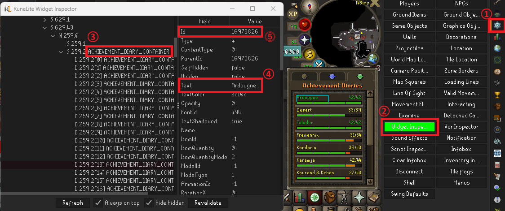
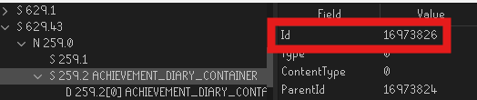
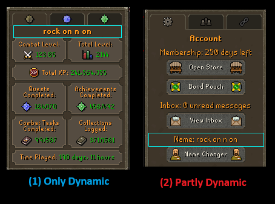
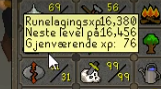
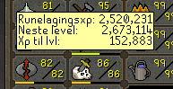
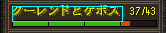

# Developer Guide for RuneLingual Plugin

Welcome to the developer guide for the RuneLingual plugin. This document is intended for developers and RuneLite reviewers to provide a comprehensive overview of the plugin.

## 1. Features

This plugin aims to translate all on-screen text. It also supports chat input for languages that use non-Latin characters. Refer to the main README for some images.

- **Translation Methods**:
  - **Manual Transcripts**: Uses transcripts created manually on the [RuneLingual transcript](https://github.com/YS-jack/Runelingual-Transcripts) repository.
  - **DeepL API**: Translates text using DeepL's API, selectable in the configuration.

## 2. Brief Explanation of What Happens

The plugin processes every text in the menu entries and visible widgets. Depending on the user's configuration:

- **DeepL Translation**: Checks if the text has been translated before. If yes, it displays the cached translation; otherwise, it translates the text via the API.
- **Manual Transcript Translation**: Searches the SQL database for the text and displays the returned translation.

## 3. Resources
This plugin downloads as well as creates some files for it to work. Here is a brief explanation of those resources:
1. On start up, the plugin checks if the transcripts has been updated by downloading the hash file of the selected language from the [RuneLingual Transcript repository](https://github.com/YS-jack/RuneLingual-Plugin/tree/master?tab=readme-ov-file), such as [the Japanese transcript](https://github.com/YS-jack/Runelingual-Transcripts/blob/original-main/public/ja/hashList_ja.txt).
2. After downloading the hash file, the plugin compares the hash with the local hash file. If the hashes are different, the plugin downloads the updated transcripts and creates/updates the local SQL database.
3. After confirming that the transcripts are up-to-date, the plugin loads the SQL database into memory for quick access.
4. Other than the transcripts, the plugin also downloads other files that are necessary for languages that use non-Latin characters, such as Japanese and Chinese. 
These files include:
   1. Character images. This will be loaded into the plugin's image cache for quick access at startup.
   2. Input mapping, such as "a" to "あ", "i" to "い", etc.
   3. The transform candidate ranking file. In case of Japanese, this will be the mapping of Hiragana to Kanji ordered in terms of frequency.
5. The plugin produces some files for the user's convenience:
   1. A list of texts and their translation by the DeepL API, which will be used instead of API calls to save translation credits.
   2. A text file whose file name includes the user's selected language to load the side panel in that language. e.g 'setLang_ja.txt' for Japanese.

## 4. Limitations

- The plugin cannot translate texts that are not widgets or menu entries, such as texts on the world map.
- Currently only translates to Japanese. Will add other languages if there are support from native speakers.
- Only translates texts in interfaces and buttons via DeepL API. This may cause texts to overlap or not fit inside the parent widget. Will add support for manual transcripts soon (TM).

## 5. Features to be Added

- **Setting Interface**: Create a settings interface that displays texts in the selected language.
- **Bank Tags**: Add bank tags to every item for searching in the selected language (may not be possible).
- **Plugin Compatibility**: Ensure compatibility with other useful plugins like the menu entry swapper and ground marker. This may involve creating similar versions within this plugin or making pull requests to those plugins.

## 6. Collecting Widget IDs
### 6.1 Obtain Widget ID
Get the Widget ID of the parent that contains the text you want to translate, by using the Widget Inspector. You need [developer mode](https://github.com/runelite/runelite/wiki/Using-the-client-developer-tools) for this.
<br> After enabling developer mode,
   - (1) open the widget inspector by clicking on the new cog icon on the right side of the client
   - (2) select Widget Inspector
   - (3) look for the text within the inspector by searching going through the widget tree
   - (4) Texts are displayed in the "Text" row
   - (5) The ID is displayed at the top after selecting the widget.
   - in this case, the widget that includes the text widget for "Ardougne" is (3).


   
- <i>Note: If (3) in the picture has a name instead of codes like the above case, you can use the name instead of the ID, explained below</i>
<br>
   
### 6.2 Add ID to Script
Add the ID to [Ids class](src/main/java/com/RuneLingual/commonFunctions/Ids.java) below line 64, like:
```java
private final int widgetIdWorldSwitcherTab = 4521984;
```
If the parent widget has a name like (3), which is "ACHIEVEMENT_DIARY_CONTAINER" in the first picture, do not write the raw ID, but instead use ComponentId class:
```java
private final int widgetIdAchievementDiaryTab = ComponentID.ACHIEVEMENT_DIARY_CONTAINER;
```
Also, if the content you are collecting texts for has many parent widgets, you can use Sets to store the parent widgets:
```java
private final Set<Integer> widgetIdSet = new HashSet<>(Arrays.asList(
    123456678, // example of a parent widget
    1234261235, // example of another parent widget
    ComponentID.ACTIVITY_CONTAINER // example of another parent widget
));
```
There will be many widgets to go through, so categorizing them will help improve readability and organization.
<br><i>If any widgets under the parent are dynamic (i.e., item name, player name), refer to the next section</i>

### 6.3. Add to SqlVariables
Add corresponding sql values to [SqlVariables class](src/main/java/com/RuneLingual/Sql/SqlVariables.java), below line 62. 
Name should be `"sourceValue4" + the name of the source`. <br>For example:
```java
sourceValue4SkillGuideInterface("skillGuide","source"), // for skill guide interface
```
The second value "source" should not be changed, as it is the name of the column in the database.

### 6.4. Add to WidgetCapture
Go to [WidgetCapture class'](src/main/java/com/RuneLingual/Widgets/WidgetCapture.java) `modifySqlQuery4Widget` function and an `if` statement to in the form of
```java
if(widgetId == ids.getNameOfIdInStep2){
  sqlQuery.setGeneralUI(SqlVariables.NameInStep3.getValue());
}
```
If in Step 2 you created a set of widget IDs, you use the `contains` function to check if the widget ID is in the set:
```java
if(ids.getWidgetIdSetInStep2().contains(widgetId)){
    sqlQuery.setGeneralUI(SqlVariables.NameInStep3.getValue());
}
```


### 6.5 Edit Output Function
After that, also in the same WidgetCapture class, edit the `ifIsDumpTarget_thenDump` function, change the first if statement to detect the widget you want to capture, like:
```java
if (sqlQuery.getSource() != null && sqlQuery.getSource().equals(SqlVariables.NameInStep3.getValue())){
...
```
Then change the file name variable `String fileName` to something appropriate, and doesnt exist yet in the `dump` folder.
You don't have to change anything else.
### 6.6 Check Output
Run the plugin and open the interface you want to capture. You should see the text file in the `RuneLingual-Plugin/output/dump` folder.
<br>The output should look like this:
```
Members: Scythe of Vitur (with <Num0> Strength)		interface	generalUI	skillGuide
Members: Soulreaper axe (with <Num0> Strength)		interface	generalUI	skillGuide
Members: Variants of Keris partisan (requires Beneath Cursed Sands)		interface	generalUI	skillGuide
Members: Osmumten's Fang		interface	generalUI	skillGuide
```
### 6.7 Check with devs
If this is your first time, be sure to make a PR to the latest branch so someone can check you are doing thing right.

## 7.1 Dynamic Texts
### There are 2 types of Dynamic texts
<br>
1. Only dynamic, such as item names, player names, etc.
2. Partially dynamic, such as "Name: (player name)" in the picture above.

### 7.1.1 Dynamic Only
For widgets with <b><u>DYNAMIC ONLY</u></b> texts, like item name, player name, add the ID to the corresponding set in [Ids class](src/main/java/com/RuneLingual/commonFunctions/Ids.java).
```java
private final Set<Integer> widgetIdPlayerName = Set.of(
        46661633,//character summary player name
        28311561,//ignore list
        458764//friends chat list
        // add if contains only player name
);

private final Set<Integer> widgetIdItemName = Set.of(
        ComponentID.COMBAT_WEAPON_NAME // combat weapon name in combat options
);

private final Set<Integer> widgetIdNpcName = Set.of(

);

private final Set<Integer> widgetIdObjectName = Set.of(

);

private final Set<Integer> widgetIdQuestName = Set.of(
        26148871 // quest name in quest list
);
```
<br>If you find other types of dynamic texts, we could make a new set, talk to the devs on Discord.
### 7.1.2 Partially Dynamic
For widgets that are <u><b>PARTIALLY DYNAMIC</b></u>, such as "Name: (player name)", you need to add an object to the PartialTranslationManager in [Ids class](src/main/java/com/RuneLingual/commonFunctions/Ids.java).
```java
partialTranslationManager.addPartialTranslation(
playerNameInAccManTab,
List.of("Name: "),
        List.of(PLAYER_NAME)
);
/* usage:
partialTranslationManager.addPartialTranslation(
        widgetId,
        List.of("fixed text part 1", "fixed text part 2", "fixed text part 3"),
        List.of(placeholder_type1, placeholder_type2)
 */
```
This will capture the text "Name: (player name)", replace the dynamic part with a placeholder.

## 7.2 Other Specifications
### 7.2.1 Configure Widget To Fit Text
- If the widget size needs to change according to the amount of text it contains, such as
<br>
<br>add it to [Ids class](src/main/java/com/RuneLingual/commonFunctions/Ids.java)'s initWidget2ModDict:
    ```java
    private void initWidget2ModDict() {
        widget2ModDict.add(widgetId, error_pixels, has_Sibling_Widget, fixed_top, fixed_bottom, fixed_left, fixed_right, top_padding, bottom_padding, left_padding, right_padding);
        widget2ModDict.add(attackStyleHoverTextId, 4, false, true, false, false, false, 1, 3, 2, 2); // spellbook tab's hover text
        widget2ModDict.add(skillsTabXpHoverTextId, 4, true, false, false, false, false, 3, 3, 3, 3); // skill tab's xp hover display
        widget2ModDict.add(prayerTabHoverTextId, 4,false, true, false, true, false, 3, 3, 3, 3);
        widget2ModDict.add(spellbookTabHoverTextId, 4,true, false, false, true, true, 2, 2, 2, 2);
    }
    ```
  After adding to the widget2ModDict, it will automatically resize to fit to the text:
<br>
<br><br><b><u>Meaning of parameters:</u></b>

- **error\_pixels**: The amount of pixels that can be stuck out when widgets are meant to be inside another.
- **has\_Sibling\_Widget**: If the widget has sibling widgets (widgets under the same parent), the plugin will resize the sibling widget as well.
- **fixed\_top**: Boolean indicating if the top of the widget is fixed. (true: fixed, false: not fixed)
- **fixed\_bottom**: Boolean indicating if the bottom of the widget is fixed.
- **fixed\_left**: Boolean indicating if the left of the widget is fixed.
- **fixed\_right**: Boolean indicating if the right of the widget is fixed.
- **top\_padding**: The padding at the top of the widget.
- **bottom\_padding**: The padding at the bottom of the widget.
- **left\_padding**: The padding at the left of the widget.
- **right\_padding**: The padding at the right of the widget.
<br><br><i> If top is fixed, the top part won't move, and it will expand/shrink at the bottom edge. Same goes for others.</i>
<br><i> If top and bottom / left and right are both fixed, it will not resize vertically / horizontally.</i>
<br><i> If both top and bottom / left and right are not fixed, it will try to expand/shrink equally on both sides.</i>
### 7.2.2 Specifying Widget Size
- To make widget size needs to a <b><u>Fixed size</u></b> like 
<br>(make it as big as possible to fit as much letters)
<br>add it to [Ids class](src/main/java/com/RuneLingual/commonFunctions/Ids.java)'s widgetId2FixedSize:
    ```java
    private final Map<Integer, Pair<Integer, Integer>> widgetId2FixedSize = Map.ofEntries(
        //Map.entry(widget_id, Pair.of(newWidth, newHeight))
        Map.entry(16973826, Pair.of(110, null)) // the achievement diary tab's location names
    );
    ```
  After adding to the widgetId2FixedSize, it will automatically set the widget size to the specified size.

### 7.2.3 Splitting Texts
- If the text is split by `<br>` tags, and there are repetitive texts, such as the XP hover which looks like:
    ```
    Agility XP:<br>Next level at:<br>Remaining XP:
    Herblore XP:<br>Next level at:<br>Remaining XP:
    Slayer XP:<br>Next level at:<br>Remaining XP:
    ```
   the `Next level at:` and `Remaining XP:` are repetitive. 
<br>In this case, add the widget ID of such texts to [Ids class](src/main/java/com/RuneLingual/commonFunctions/Ids.java)'s widgetId2SplitTextAtBr:
    ```java
    private final Set<Integer> widgetId2SplitTextAtBr = Set.of(
            skillsTabXpHoverTextId, // skill tab's xp hover display
            xpBarTopRightHoverTextId // hover display of xp bar top right
    );
    ```
    This will split the text at the `<br>` tags and translate the repetitive parts only once.

### 7.2.4 Useful Tags
I have implemented some tags to make the translation process easier.<br>The tags are as follows:
  - The <b>asis</b> tag allows you to specify parts that should be displayed as is, without translation nor replaced with char iamges.<br>Usage: ```<asis>text to display as is</asis>```
  - The <b>```<Num#>```</b> tag is a placeholder for numbers and represents a specific number, so it can contain any number.<br> This was implemented to reduce the number of translations that differ only by numbers.<br>This should be automatically be inserted inplace of numbers automatically.
  - The <b>```<colNum#>```</b> tag is similar to the <Num#> tag above, but it contains color tag (which specifies colors for parts of texts) instead of numbers.<br> This should be closed with <b>```</col>```</b> tag.
  - The ```<br>``` tag is a breakline tag, which will make split the line where the tag is placed, and make the part after ```<br>``` be placed in a new line.<br> <b>This will stop any automatic breakline from happening</b>.<br>To use ```<br>``` but still benefit from the automatic fucntion of inserting break line according to text length function the code has, use the next tag.
  - The ```<autoBr> ... </autoBr>``` allows you to specify parts to insert break line automatically. This is used when you have break line code ```<br>``` in a translation, which stops automatic breaklines from being inserted, but still want the code to insert breakline automatically in other parts of the translation.<br>The part surrounded by ```<autoBr>``` and ```<noAutoBr>``` will have break lines inserted automatically.<br><b>Note</b>: you dont have to use this if there are no ```<br>``` tags in the translation.