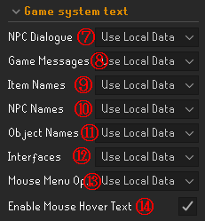

| UI画像 | 説明 |
|:--------:|:-------------|
|  | 1. 画面右側の工具のアイコン: クリックして設定を開きます。  2. 工具アイコンのタブ: 開いたら同じく工具アイコンのタブを開きます。  3. 「RuneLingual」の横のスライド: オレンジになるようスライドして有効化します。  4. 「RuneLingual」の横の歯車アイコン: クリックして設定の変更ができます。 |

|                                                                UI画像                                                                | 説明                                                                                                                                                                                                                          |
|:--------------------------------------------------------------------------------------------------------------------------------------:|:--------------------------------------------------------------------------------------------------------------------------------------------------------------------------------------------------------------------------------------|
|                                                                          |    1. 言語選択 2. 設定解説のURL        3. オンライン翻訳の有効･無効  4. 消費文字数や制限の表示  5. 翻訳サービスの選択  6. 使用するサービスのAPI                                                                          |
|     |  7. NPCとの会話 8. ゲームのメッセージ  9. アイテム名 10. NPC名  11. オブジェクト名 12. インターフェース  13. マウスメニュー 14. マウス横のオーバーレイ   Use Local Data = ローカル翻訳データ   Use Api = オンライン翻訳（DeepLなど）  Dont Translate = 翻訳しない                             |
|   |  15. 公共 16. クラン  17. クラン 18. クラン  19. グループ鉄人  Transform = ローマ字変換 Use Api = オンライン翻訳 Leave As Is = そのまま|
|      |  20. 公共 21. フレンドチャット  22. ゲストクラン 23. フレンドチャット  24. グループ鉄人  Transform = ローマ字変換 Leave As Is = そのまま |
|                                                                          | **発言の強制的な設定** 以下に名前を書いたプレイヤーはここ以外の設定に含まれていても ここでの設定が優先的に作用します。 名前どうしはカンマもしくは改行で区切ってください。   25. そのまま表示  26. APIで翻訳  27. ローマ字変換    28. データファイルの保存場所      |

| UI画像 | 説明 |
|:--------:|:-------------|
|  | ダイアログボックスに表示される文章はここにも表示されます。コピーすることができるのでご活用ください。 |

| UI画像 | 説明 |
|:--------:|:-------------|
|  | 英語名を入力すると日本語訳を検索できます。 |

| UI画像 | 説明 |
|:--------:|:-------------|
|  | 日本語名を入力すると英語の元の名前が検索できます。 |
